# ОТЧЁТ ПО ТЕМЕ "ТВОРЧЕСКАЯ РАБОТА"
# Автоматизированное рабочее место специалиста

## Постановка задачи
Реализовать автоматизированное рабочее место классного руководителя. Автоматизированное рабочее место (АРМ) - это компьютерная система, разработанная для автоматизации и оптимизации рабочего процесса. Она может включать в себя программное обеспечение для выполнения различных задач, аппаратные средства, такие как компьютер, монитор, клавиатура, мышь и другие периферийные устройства. АРМ может быть специально настроенным для выполнения конкретных задач, что позволяет повысить эффективность работы и сократить время на выполнение рутинных задач.

В данном проекте должны быть представлены следующие функции:
- Управление событиями.
- Связь с базой данных и обработка информации из неё.
- Хранение информации внутри проекта и вне его.


## Анализ задачи

- Для обработки событий использован фреймворк ```Qt```. ```Qt``` - это кроссплатформенный фреймворк для разработки приложений с графическим интерфейсом пользователя *(GUI)* на языке программирования ```C++```. Он предоставляет различные инструменты и библиотеки для создания многопоточных, многоплатформенных и многозадачных приложений.

- В качестве базы данных использована ```SQLite``` - легковесная встраиваемая реляционная база данных, которая предоставляет множество функций для хранения, управления и извлечения данных.  Одна из главных особенностей ```SQLite``` - это то, что она не является отдельным сервером баз данных, но является библиотекой, которую можно встроить в приложение. Это означает, что база данных ```SQLite``` хранится в одном файле на диске, что делает ее легко переносимой и удобной в использовании. ```SQLite``` поддерживает стандарт ```SQL```, что позволяет использовать ее с любым языком программирования, который поддерживает работу с базами данных через ```SQL-запросы```.

- Для работы с базой данных использован система управления баз данных ```SQLite Studio``` - это бесплатное кроссплатформенное приложение для работы с базами данных ```SQLite```. Оно предоставляет множество функций для создания, управления, редактирования и просмотра данных в базах данных ```SQLite```. ```SQLite Studio``` имеет интуитивно понятный интерфейс пользователя, который позволяет выполнять различные операции с базами данных ```SQLite```, такие как создание, изменение и удаление таблиц, индексов и триггеров, выполнение ```SQL-запросов``` и многое другое.

- Для обработки информации и её хранения, полученной из баз данных использовались следующие классы ```Qt```:
    - ```QDate``` - это класс в ```Qt```, который представляет дату в григорианском календаре. Он предоставляет методы для работы с датами, такие как установка, получение и форматирование даты.
    - ```QTextStream``` - это класс в ```Qt```, который предоставляет удобный интерфейс для чтения и записи текстовых данных в потоки *(streams)*. Он предоставляет методы для форматированного вывода данных в текстовом формате и чтения данных из текстовых потоков. Для работы с потоками ```QTextStream``` обычно используются объекты класса ```QFile```, который представляет файл на диске.
    - ```QFile``` - это класс в ```Qt```, который предоставляет удобный интерфейс для работы с файлами на диске. Он позволяет открывать, создавать, записывать и читать файлы с помощью низкоуровневых операций ввода-вывода.

## UML-диаграмма
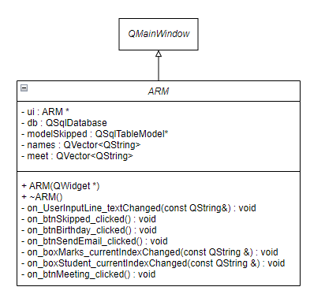

## Скриншоты работы программы
Рис. 1 - Отображение отсортированных оценок учеников по предметам и оценки каждого ученика отдельно.
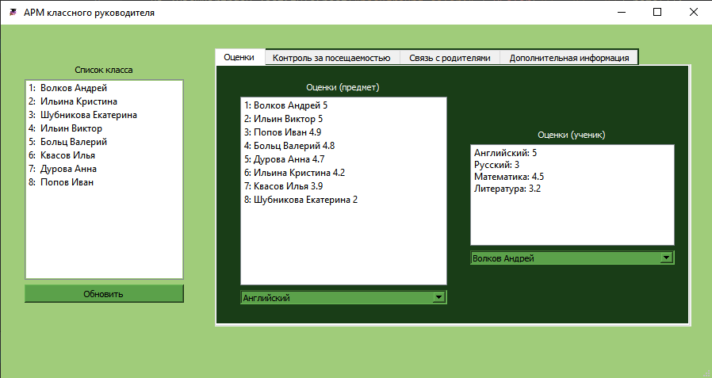

Рис. 2 - Отображение модельного представления таблицы пропущенных занятий.
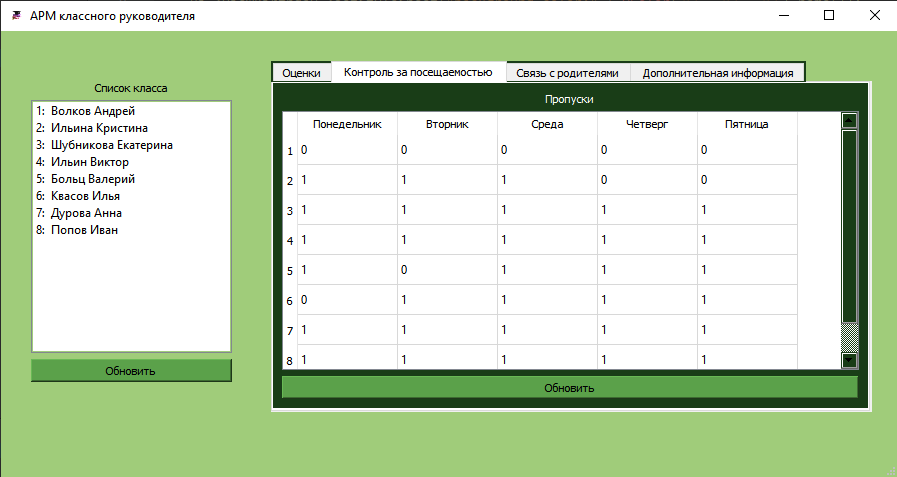

Рис. 3 - Работа с поиском информации в АРМ.
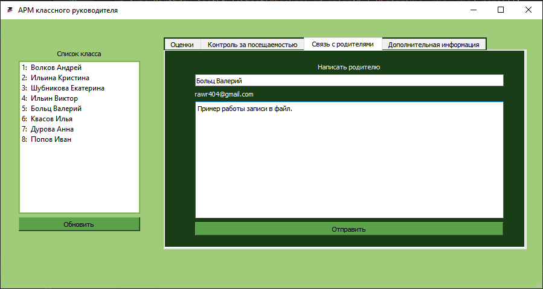

Рис. 4 - Работа с текстовыми файлами.
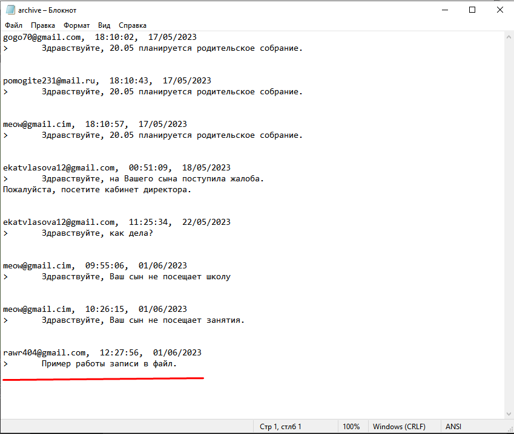

Рис. 5 - Работа с датой и хранение информации внутри проекта АРМ.
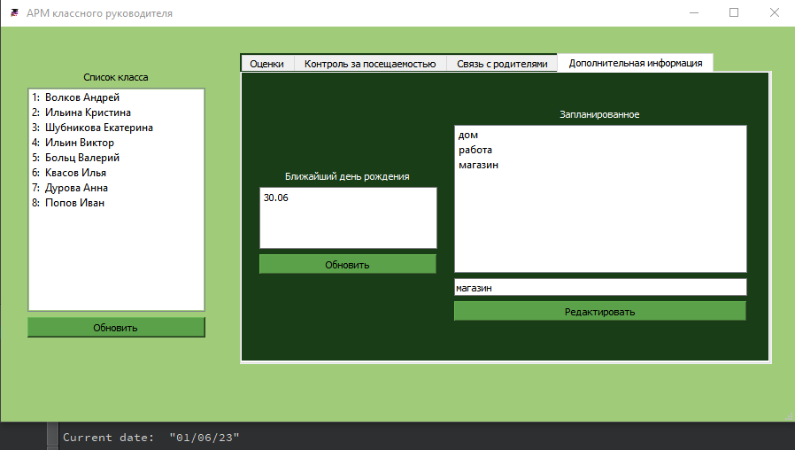

Рис. 6 - Информация об учениках в базе данных.
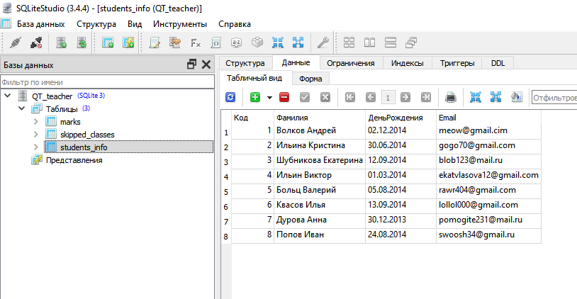

Рис. 7 - Информация об оценках в базе данных.
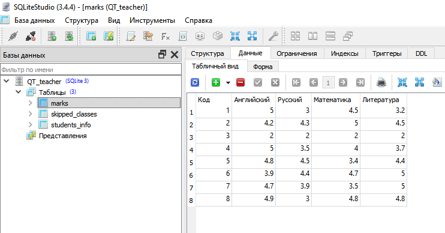

Рис. 8 - Информация о пропусках в базе данных. 
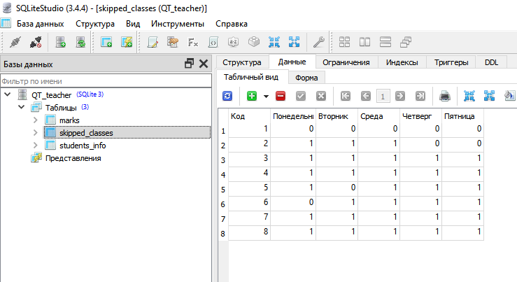

---
# Задача коммивояжёра 
## Постановка задачи
Реализовать алгоритм решения задачи коммивояжёра ```методом динамического программирования по подмножествам (по маскам)```. Задача коммивояжера - это классическая задача оптимизации маршрута, в которой необходимо определить наименьший замкнутый маршрут, проходящий через заданный набор городов, при условии, что каждый город должен быть посещен только один раз и маршрут должен начинаться и заканчиваться в одном и том же городе. Формально задача может быть сформулирована следующим образом: пусть имеется граф G = (V, E), где V - множество городов, а E - множество дорог между городами. Требуется найти замкнутый путь минимальной длины, проходящий через каждый город из множества V ровно один раз. Решение задачи коммивояжера является NP-полной проблемой, что означает, что алгоритмы, которые гарантированно находят оптимальное решение, могут работать очень долго на больших наборах данных. В связи с этим, для решения задачи коммивояжера часто используются эвристические алгоритмы, которые находят достаточно хорошее решение за разумное время.

В данном проекте должны быть представлены следующие программные решения:
- Реализация графа.
- Реализация алгоритма динамического программирования по маскам.
## Aнализ задачи
- Граф - это абстрактная структура данных, представляющая собой набор вершин и ребер, связывающих эти вершины. В *C++* граф можно реализовать с помощью различных структур данных, например, с помощью матрицы смежности. Матрица смежности представляет граф в виде двумерного массива, где элемент *(i, j)* равен *1* (или любому положительному числу), если между вершинами *i* и *j* есть ребро, и *0* в противном случае. Если граф неориентированный, то матрица симметрична относительно главной диагонали.
- Решение задачи коммивояжёра по подмножествам заключается в том, чтобы решить задачу для всех подмножеств вершин, начинающихся с вершины *1* и заканчивающихся в вершине *i*, где *i* - это каждая из вершин графа, кроме вершины *1*. Затем находим минимальную сумму расстояний по всем подмножествам и получаем минимальный замкнутый маршрут. Для решения задачи коммивояжера по подмножествам можно использовать динамическое программирование. Для этого создадим массив masked, где ```masked[S][i]``` - это минимальное расстояние между вершинами 1 и *i*, проходящее через все вершины из подмножества *S*. Начальное значение ```masked[{}, 1]``` = 0, а все остальные значения ```masked[S][i] = INF```, где *INF* - это бесконечность. Затем для каждого подмножества *S* и каждой вершины *i* из этого подмножества перебираем все вершины *j*, не принадлежащие *S*, и вычисляем ```masked[S | {j}][j] = min(masked[S | {j}][j], masked[S][i] + adj[i][j])```, где ```adj[i][j]``` - это расстояние между вершинами *i* и *j*. После того, как мы посчитали все значения ```masked[S][i]```, находим минимальное значение ```masked[{1, 2, ..., n-1}][i] + masked[i][1]``` для всех *i* от *2* до *n* и получаем минимальную сумму расстояний по всем подмножествам. Затем восстанавливаем минимальный замкнутый маршрут, проходя через все вершины, используя массив ```masked```.
- Для визуализации графа были использованы следующие классы ```Qt```:
    - ```QGraphicsScene``` - это класс в ```Qt```, который представляет собой сцену для отображения графических элементов, таких как фигуры, текстовые метки и изображения. Он предоставляет возможности для добавления, удаления и перемещения элементов сцены, а также для обработки событий, связанных с этими элементами. Каждый элемент на сцене представлен объектом ```QGraphicsItem``` или его наследником.
    - ```QGraphicsItem``` - это абстрактный класс, который определяет базовые свойства и методы для всех графических элементов. Является базовым классом для всех графических элементов на сцене, таких как прямоугольники, эллипсы, линии, текстовые метки и т.д. Каждый элемент на сцене имеет свойство ```QGraphicsItem::pos```, которое определяет его позицию на сцене. Элементы могут иметь другие свойства, такие как цвет, ширина линии, стиль и т.д., которые могут быть установлены с помощью различных методов, в зависимости от типа элемента. В проекте использован ```QGraphicsEllipseItem``` - элемент в форме эллипса.
    - ```QLineF``` и ```QPointF``` - это классы в ```Qt```, которые представляют собой геометрические объекты на плоскости. ```QLineF``` представляет собой линию на плоскости и определяется двумя точками ```QPointF``` - начальной и конечной точкой линии. QPointF представляет собой точку на плоскости и задается двумя координатами - координатой x и координатой y.

## UML-диаграмма
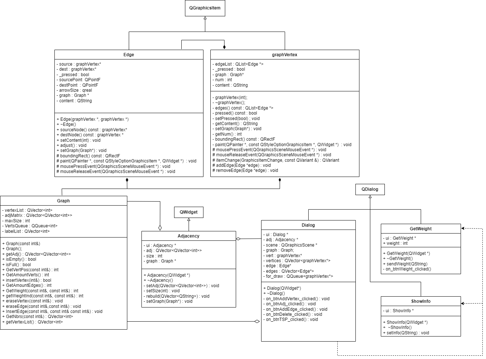

## Скриншоты работы программы
Рис. 1 - Создание вершин.
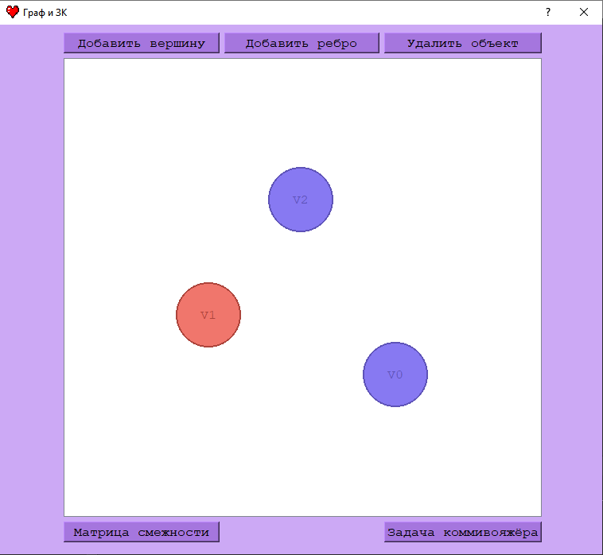

Рис. 2 - Создание рёбёр.
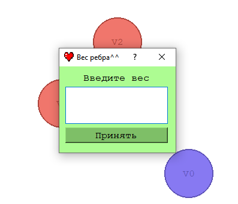

Рис. 3 - Пример графа.
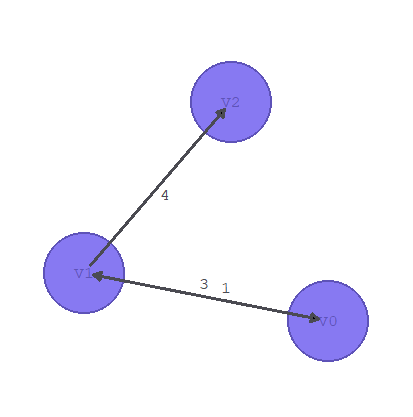

Рис. 4 - Матрица смежности, соотвествующая графу из (Рис. 3)
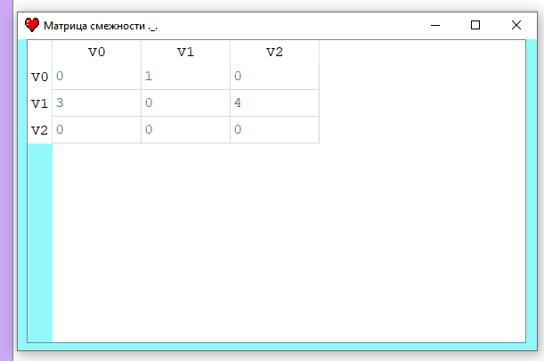

Рис. 5 - Пример решения задачи коммивояжёра.
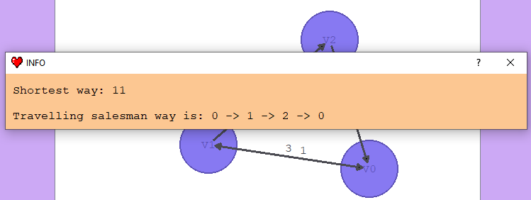

---
[Ссылка на видео](https://youtu.be/5hueaYQ0u94)
